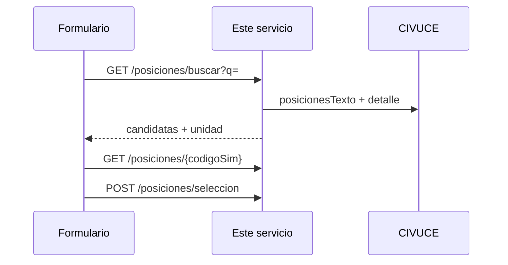

# Posiciones arancelarias (CIVUCE)

Servicio Java 17 / Spring Boot 3 para **búsqueda de posiciones arancelarias de exportación** a partir de una descripción en lenguaje natural, con **unidad de medida** (Anexo XV SIM).

Este repositorio es la entrega completa para **Sistemas**. Operación, claves, despliegue e integración con el formulario de artículos quedan de este lado. No hay componente adicional del equipo de IA.

La clasificación es **orientativa**: no es dictamen aduanero ni autoriza la exportación. El campo `avisoLegal` de cada respuesta debe mostrarse al usuario.

## Requisitos

- JDK 17+
- Acceso a CIVUCE (`CIVUCE_BASE_URL`)
- Clave de [OpenRouter](https://openrouter.ai/) (opcional pero recomendada: mejora queries cortas y el ranking semántico)

## Arranque local

```bash
cp .env.example .env
# completar OPENROUTER_API_KEY y, si aplica, CORS_ALLOWED_ORIGINS

cd backend
./mvnw spring-boot:run          # Linux / macOS
.\mvnw.cmd spring-boot:run      # Windows
```

Puerto default: `8080` (`SERVER_PORT`). Health: `GET http://localhost:8080/api/v1/health`

## API

OpenAPI: [`backend/src/main/resources/openapi/posiciones-arancelarias.yaml`](backend/src/main/resources/openapi/posiciones-arancelarias.yaml)

```http
GET  /api/v1/health
GET  /api/v1/posiciones/buscar?q=remera
GET  /api/v1/posiciones/{codigoSim}
POST /api/v1/posiciones/seleccion
Content-Type: application/json

{"consulta":"remera","codigoSim":"6109.10.00.110Y"}
```

### Integración en «Agregar artículo»

1. El usuario escribe la descripción y pulsa **Buscar** (no hace falta debounce en vivo).
2. Mostrar `resultados[].items`: código NCM, SIM, descripción, unidad de medida.
3. Al elegir un ítem:
   - `GET /api/v1/posiciones/{codigoSim}` para detalle, unidad y derechos.
   - `POST /api/v1/posiciones/seleccion` con la consulta original y el SIM elegido, para que el ranking aprenda.



### Campos útiles de la búsqueda

- `unidadCodigo` / `unidadMedida`: unidad SIM (Anexo XV).
- `sugeridoPorIa`: el término de búsqueda salió del modelo de lenguaje.
- `boostHistorial`: esa posición ya fue elegida para una consulta similar.
- `avisoLegal`: texto para mostrar junto al resultado.

## Cómo funciona (resumen)

1. Traduce la consulta a términos del nomenclador (léxico +, si la query es corta, LLM).
2. Consulta CIVUCE (`/cice/posicionesTexto`, todas las páginas; `/cice/posicion/{codigo}` para la jerarquía NCM).
3. Rankea por coincidencia de palabras y por similitud semántica del **encabezado de partida** (embeddings).
4. Devuelve todas las hojas SIM de las partidas ganadoras (p. ej. distintas capacidades de un termo).
5. Si el usuario elige un código, guarda la consulta + embedding para boostear búsquedas parecidas.

Sin `OPENROUTER_API_KEY` el servicio igual busca en CIVUCE; no interpreta queries cortas ni re-rankea con embeddings.

## Variables de entorno

Copiar `.env.example` a `.env` en la raíz del repo o en `backend/`.

| Variable | Default | Uso |
|----------|---------|-----|
| `OPENROUTER_API_KEY` | (vacío) | Opcional. LLM + embeddings |
| `OPENROUTER_MODEL` | `google/gemini-2.5-flash-lite` | Interpretación de queries cortas |
| `OPENROUTER_EMBEDDING_MODEL` | `openai/text-embedding-3-small` | Ranking de partidas e historial |
| `CIVUCE_BASE_URL` | `https://qa.ci.vuce.gob.ar` | Ambiente CIVUCE |
| `CIVUCE_AUTH_EMAIL` | `vuce@vuce.gob.ar` | Auth del portal |
| `CIVUCE_MAX_RESULTADOS` | `12` | Tope de **partidas** (cada una trae todas sus hojas SIM) |
| `HISTORIAL_PATH` | `data/selecciones.jsonl` | Aprendizaje por selección (sin base de datos) |
| `HISTORIAL_UMBRAL` | `0.82` | Coseno mínimo para boost de historial |
| `CORS_ALLOWED_ORIGINS` | `http://localhost:8080,...` | Orígenes del front de Sistemas |
| `SERVER_PORT` | `8080` | HTTP |

La paginación de CIVUCE no tiene tope de páginas: se recorre hasta agotar `total`.

## Operación

- **CIVUCE** y **OpenRouter** son responsabilidad de quien opera este servicio (claves, cuotas, ambientes QA/prod).
- El historial vive en un JSONL (`HISTORIAL_PATH`). No hay base de datos. Hay que persistir ese archivo entre deploys si se quiere conservar el aprendizaje.
- CORS: setear `CORS_ALLOWED_ORIGINS` al origen real del front.
